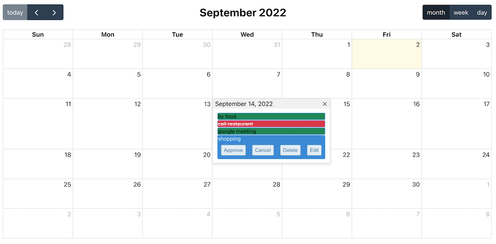
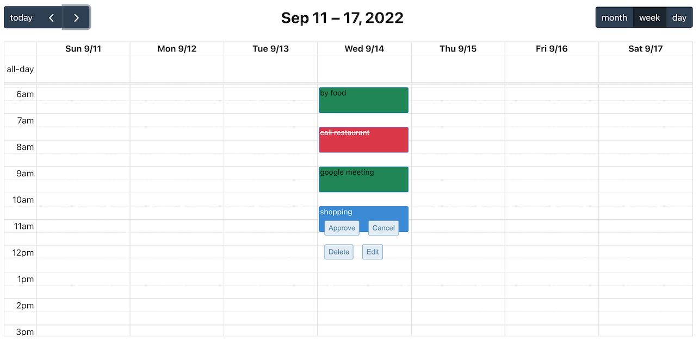
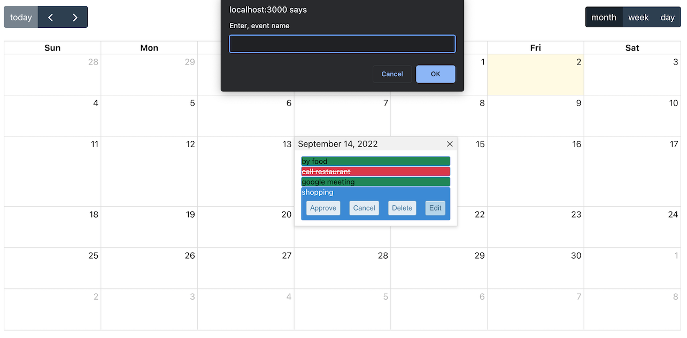

## Available Scripts

In the project directory, you can run:

### `npm start`

Runs the app in the development mode.\
Open [http://localhost:3000](http://localhost:3000) to view it in your browser.

The page will reload when you make changes.\
You may also see any lint errors in the console.

### The challenge

Users should be able to:
- Create a Event in the calendar
- Approve or cancel a Event
- Delete or Edit a Event

### Built with

- [React](https://reactjs.org/) - JS library
- [FullCalendar](https://fullcalendar.io/docs) - Calendar Library
- Sass/CSS3/Flexbox

### Screenshot

